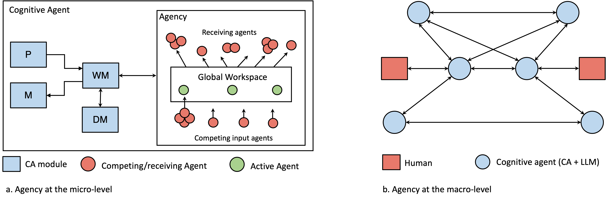

# Integration of Large Language Models and Cognitive Architectures
[](https://awesome.re) [](https://github.com/ysymyth/awesome-language-agents/pulls)

## Summary
- List of references: [bibliography.bib](bibliography.bib)

## Paper Overview
To build artificial agents that exhibit intelligent behavior, two AI subdisciplines must be synergistically integrated and reconciled: Large Language Models (LLMs)
and Cognitive Architectures (CAs). We present three integration approaches, each grounded in theoretical models and supported by preliminary empirical evidence. 


The modular approach, which introduces four models with varying degrees of integration, makes use of chain-of-thought prompting, and draws inspiration from augmented LLMs, the Common Model of Cognition, and the simulation theory of cognition. 



The agency approach, motivated by the Society of Mind theory and the LIDA cognitive architecture, proposes the formation of agent collections that interact at micro and macro cognitive levels, driven by either LLMs or symbolic components. 


The neuro-symbolic approach, which takes inspiration from the CLARION cognitive architecture, proposes a model where bottom-up learning extracts symbolic representations from an LLM layer and top-down guidance utilizes symbolic representations to direct prompt engineering in the LLM layer. These approaches aim to harness the strengths of both LLMs and CAs, while mitigating their weaknesses, thereby advancing the development of more robust AI systems. 

## Citation

How to cite our paper:

```bibtex
@inproceedings{romero_2023_llm_ca,
      title = {Synergistic Integration of Large Language Models and Cognitive Architectures for Robust AI: An Exploratory Analysis},
      booktitle = {Proceedings of the 2023 {AAAI} Fall Symposium on Integrating Cognitive Architectures and Generative Models},
      author = {Romero, Oscar J. and Zimmerman, John and Steinfeld, Aaron and Tomasic, Anthony},
      year = {2023},
      Publisher = {AAAI Press},
}
```

Preprint:
```bibtex
@misc{romero2023synergistic,
      title={Synergistic Integration of Large Language Models and Cognitive Architectures for Robust AI: An Exploratory Analysis}, 
      author={Oscar J. Romero and John Zimmerman and Aaron Steinfeld and Anthony Tomasic},
      year={2023},
      eprint={2308.09830},
      archivePrefix={arXiv},
      primaryClass={cs.AI}
}
```

## Resources

- [CLARION cognitive architecture](https://sites.google.com/site/drronsun/clarion/clarion-project)
- [ACT-R cognitive architecture](http://act-r.psy.cmu.edu/about/)
- [LIDA cognitive architecture](https://ccrg.cs.memphis.edu/tutorial/)
- [Common Model of Cognition](https://ojs.aaai.org/aimagazine/index.php/aimagazine/article/view/2744)
- [Voyager: An Open-Ended Embodied Agent with LLM](https://voyager.minedojo.org/)
- [Generative Agents: Interactive Simulacra of Human Behavior](https://github.com/joonspk-research/generative_agents)
- [AutoGPT: Build & use AI agents](https://github.com/Significant-Gravitas/AutoGPT)
- [BabyAGI](https://github.com/yoheinakajima/babyagi)
- [CoALA](https://github.com/ysymyth/awesome-language-agents/tree/main)
More coming soon...


