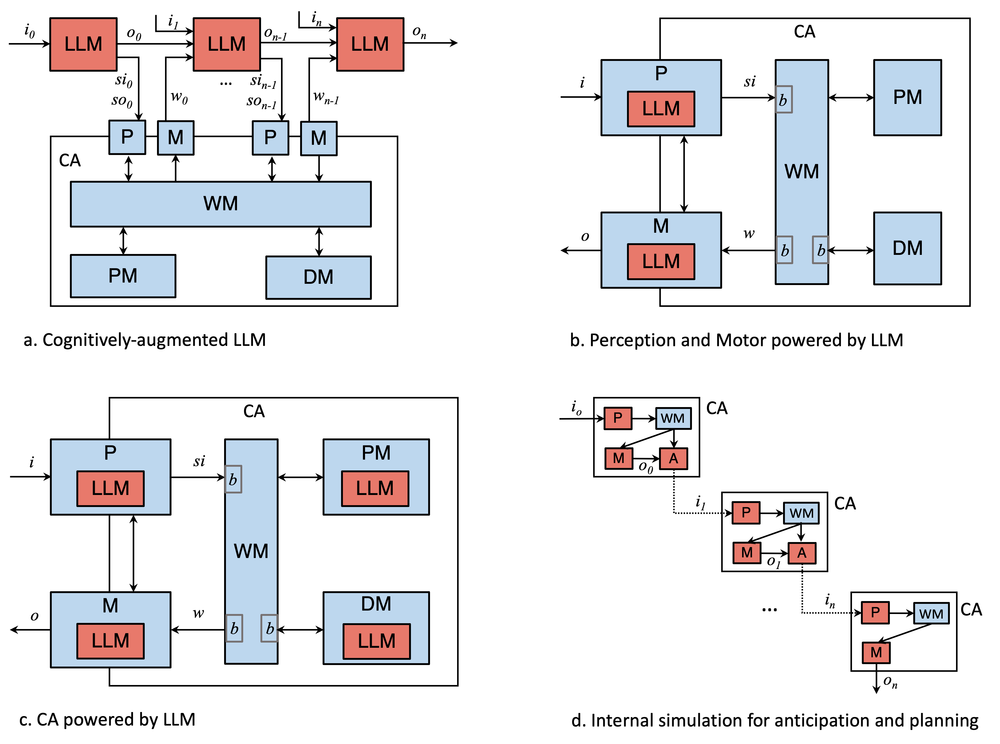
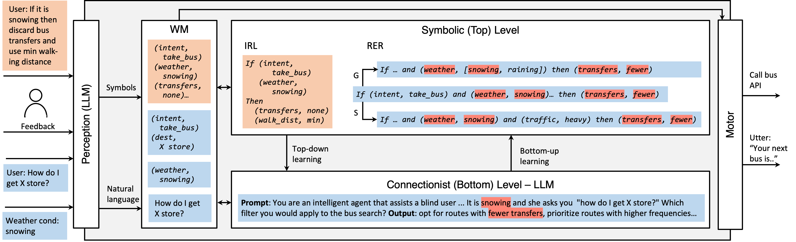

# Integration of Large Language Models and Cognitive Architectures
[](https://awesome.re) [](https://github.com/ysymyth/awesome-language-agents/pulls)

## Summary
- List of references: [bibliography.bib](bibliography.bib)
- Related Tweets: https://x.com/oscar_j_romero/status/1738166217553117215?s=20
- [Resources](#resources)

## Paper Overview
Overview of the paper "Synergistic Integration of Large Language Models and Cognitive Architectures for Robust AI: An Exploratory Analysis". 

To build artificial agents that exhibit intelligent behavior, two AI subdisciplines must be synergistically integrated and reconciled: Large Language Models (LLMs) and Cognitive Architectures (CAs). We present three integration approaches, each grounded in theoretical models and supported by preliminary empirical evidence. 

### Modular Approach



The modular approach, which introduces four models with varying degrees of integration, makes use of chain-of-thought prompting, and draws inspiration from augmented LLMs, the Common Model of Cognition, and the simulation theory of cognition. 

**Features:**
1. The first case, the cognitively augmented LLM, aligns with the current trend of augmenting LLMs with external tools and interpreters and represents the most loosely integrated model among the four. In this case, the LLM retains control of execution, and the outputs of the CA are solely utilized for in-context learning purposes. The strength of this approach is that recursive LLMs receive gradual guidance during the chain-of-thought reasoning process. However, a notable disadvantage is that, due to the lack of overall control, the CA components can only contribute to reactive (System 1) responses rather than deliberative, high-order (System 2) ones.
1. The second case of the modular approach presents a moderately integrated model where only the perception and motor modules of a CA are powered with LLMs. The main strength of this model is that it aligns with the evident benefits obtained from multi-modal LLMs, which notably enhance text and image understanding, avoiding the need for task-specific and laborious labeling and training of machine learning models. Another advantage of this case is that it assumes a straightforward transformation from sensory inputs to symbolic percepts, which facilitates further processing. However, one main disadvantage is that the other modules of the CA still do not fully leverage the power of LLMs.
1. The third case presents a tightly integrated model that leverages the synergistic interaction between LLMs and symbolic components of a CA. LLMs extract factual knowledge from the world, automatically populating ontologies. These semantic representations then facilitate the creation of world models, addressing a limitation of LLMs. Furthermore, proper LLM's prompt engineering techniques would produce syntactically and semantically correct CA productions, which can be later compiled by a symbolic engine. However, a drawback of this integrated system is its heavy reliance on LLM outputs, rendering it susceptible to cascading failures, including hallucinations and biases.
1. The fourth case represents the most tightly integrated model. It involves a module designed for simulating the outcomes of future events. The primary advantage of this case is its capability to anticipate and plan by traversing and backtracking a tree-like structure of possible events. However, similar to the third case, this system heavily relies on the outputs of the LLM, which might occasionally be inconsistent. This inconsistency could lead to erroneous predictions in the early stages of internal simulation, resulting in cascading errors in the planning process. 

### Agency Approach


The agency approach, motivated by the Society of Mind theory and the LIDA cognitive architecture, proposes the formation of agent collections that interact at micro and macro cognitive levels, driven by either LLMs or symbolic components. 

**Features:**
1. Unlike the Modular approach, which can suffer from overall failures and inconsistencies if individual modules are poorly designed, the Agency approach at the micro-level offers greater robustness from two key angles.
2. First, agents may encode redundant knowledge, resulting in multiple agents capable of achieving the same competence. This redundancy enhances system resilience as individual agents may fail, yet the system can still yield satisfactory outcomes.
3. Second, agent role-playing strategies enable the system to self-reflect and promptly rectify potential deviations in reasoning processes. At the macro-level, the Agency approach stands out as the only one among the three approaches that consider inter-agent interactions, with a primary focus on collaborative interactions between agents and humans.
4. Aspects such as communication, coordination, hierarchies, etc. between agents remain open questions.


### Neuro-symbolic Approach



The neuro-symbolic approach, which takes inspiration from the CLARION cognitive architecture, proposes a model where bottom-up learning extracts symbolic representations from an LLM layer and top-down guidance utilizes symbolic representations to direct prompt engineering in the LLM layer. These approaches aim to harness the strengths of both LLMs and CAs, while mitigating their weaknesses, thereby advancing the development of more robust AI systems. 

**Features:**
1. The Neuro-symbolic approach is arguably the most tightly integrated model. It leverages the capabilities of LLMs to seamlessly translate unstructured natural language into structured symbolic representations and vice versa.
2. This approach plays a crucial role in extracting rules from the connectionist level and subsequently generalizing and specializing those extracted rules over time. The interactions between the symbolic and connectionist levels enable the continuous construction of explainable models for decision-making and procedural processing based on black-boxed LLMs.
3. A potential weakness of this approach lies in its heavy reliance on the LLM layer.

**Commonalities:**
1. The working memory, along with the perception module, plays an important role in retaining the most pertinent information while filtering out irrelevant stimuli. This contrasts with the idea of a context window in LLMs, where truncation strategies arbitrarily delete the oldest tokens observed when the length of the window reaches a maximum, potentially discarding critical parts of the context. The contents of the working memory are selectively and intentionally stored and recalled from long-term memories, allowing the agent to continuously interact with the environment without losing track of events. 
1. The utilization of LLMs to accurately translate unstructured natural language to symbols and vice versa, as well as to extract factual knowledge about the world. This breakthrough opens up a realm of new possibilities, allowing for the seamless scaling of CAs to tackle complex real-world problems. 
1. Third, the three approaches can benefit from multi-modal multi-turn interaction. In cases where cognitive agents collaborate with humans, there is an opportunity to incrementally refine shared mental models of a task through continuous conversational interaction and scene understanding. 
1. Since all the approaches depend, in one way or another, on LLMs, they are susceptible to the stochastic nature of LLMs. This stochastic nature leads to variations (sometimes remarkable) in the outputs, even when the model is prompted with exactly the same input.
1. All three approaches contribute, to a greater or lesser extent, to the continuous construction of cognitive models about the entities in the world, their relationships, and the distinct cognitive processes that operate over them.


## Citation

How to cite our paper:

```bibtex
@inproceedings{romero2023synergistic,
  title={Synergistic integration of large language models and cognitive architectures for robust ai: An exploratory analysis},
  author={Romero, Oscar J. and Zimmerman, John and Steinfeld, Aaron and Tomasic, Anthony},
  booktitle={Proceedings of the AAAI Symposium Series},
  publisher={AAAI Press},
  volume={2},
  number={1},
  pages={396--405},
  year={2023}
}
```

## Resources

### Cognitive Architectures
- [CLARION cognitive architecture](https://sites.google.com/site/drronsun/clarion/clarion-project)
- [ACT-R cognitive architecture](http://act-r.psy.cmu.edu/about/)
- [LIDA cognitive architecture](https://ccrg.cs.memphis.edu/tutorial/)
- [Common Model of Cognition](https://ojs.aaai.org/aimagazine/index.php/aimagazine/article/view/2744)
- [40 years of Cognitive Architectures](https://link.springer.com/article/10.1007/s10462-018-9646-y)

### LLM + Cognitive Architectures
**Papers**
- [(2024-Sun) Can A Cognitive Architecture Fundamentally Enhance LLMs? Or Vice Versa? (Ron Sun)](https://arxiv.org/pdf/2401.10444.pdf)
- [(2023-Weston-et.al) System 2 Attention (is something you might need too)](https://arxiv.org/pdf/2311.11829.pdf)
- [(2023-Wang) Voyager: An Open-Ended Embodied Agent with LLM](https://voyager.minedojo.org/)
- [(2023-Park) Generative Agents: Interactive Simulacra of Human Behavior](https://github.com/joonspk-research/generative_agents)
- [(2023-Lenat-Marcus) Getting from Generative AI to Trustworthy AI: What LLMs might learn from Cyc](https://arxiv.org/pdf/2308.04445.pdf)
- [(2023-Summers-et.al) Cognitive Architectures for Language Agents](https://arxiv.org/abs/2309.02427)
- [(2023) AAAI Fall Symposia - Integration of Cognitive Architectures and Generative Models (25+ papers)](https://ojs.aaai.org/index.php/AAAI-SS/issue/view/574)
  
**Miscellaneous (code repos, talks, resources)**
- [AutoGPT: Build & use AI agents](https://github.com/Significant-Gravitas/AutoGPT)
- [BabyAGI](https://github.com/yoheinakajima/babyagi)
- [CoALA](https://github.com/ysymyth/awesome-language-agents/tree/main)
- [NARS-Gpt](https://github.com/opennars/NARS-GPT)


More coming soon...


